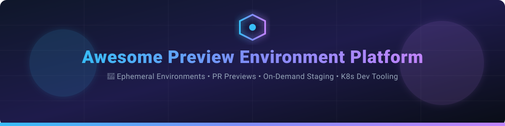

# Awesome Preview Environment Platform 🚀

## 📌 Top Preview Environment Platforms Ecosystem

**Curated List of SaaS Products & Open-Source GitHub Projects for Ephemeral Preview Environments**

*Focused on Ephemeral Environments, Pull Request Previews, On-Demand Staging & Kubernetes Development Environments*

**Last updated: September 2026** 📅

---

### 💡 Overview & Category Insights

This repository tracks notable **SaaS platforms** and **open-source projects** for **Preview Environments**. These systems automatically create isolated, temporary environments for every pull request or branch so software teams can review, test, and share full-stack changes before shipping to production.

#### 📊 Market Size & Industry Structure Analysis
> 📈 **Estimated Market Size & Fragmentation:**  
> The Ephemeral Environments & Preview Deployment sector is estimated at **$2.5B - $4.0B+** (part of the broader $15B+ Cloud Development & Developer Experience / Internal Developer Platform market).  
> **Market Dynamics:** The sector is **moderately fragmented with clear category leaders in sub-niches**. General cloud hosting & frontend previews show high consolidation around behemoths like **Vercel** ($3.25B valuation) and **Netlify**, whereas complex Kubernetes-native and full-stack backend ephemeral environments remain competitive with specialized players (**Signadot**, **Qovery**, **Release**, **Northflank**, **Uffizzi**).

---

## 📑 Table of Contents
- [🏢 SaaS & Hosted Platforms](#-saas--hosted-platforms)
- [🔓 Open-Source GitHub Projects](#-open-source-github-projects)
- [🛠️ How to Contribute](#️-how-to-contribute)
- [💖 Support & Sponsorship](#-support--sponsorship)
- [⚠️ Disclaimer](#️-disclaimer)
- [📈 Star History](#-star-history)

---

## 🏢 SaaS & Hosted Platforms

*Sorted by Company Size / Valuation / Estimated Revenue (Descending)* 📉

| Product | Description | Company Size / Valuation / Revenue | Starting Price | Free Tier Limits |
| :--- | :--- | :--- | :--- | :--- |
| **[Vercel Preview Deployments](https://vercel.com/)** ⚡ | Automatic preview deployments for every push & PR, tightly integrated with Next.js & frontend workflows. | **$3.25B+ Valuation** (~$100M+ ARR) | $20/seat/month (Pro Plan) | Free Hobby plan (non-commercial): 100 GB bandwidth/mo, 1M function invocations/mo |
| **[Netlify Deploy Previews](https://www.netlify.com/)** 🌐 | Deploy Previews generating unique URLs per pull request for team review before production. | **$2.0B+ Valuation** (~$80M+ ARR) | $9/month (Personal) / $20/month (Pro) | Free plan: 300 credits/month (covers bandwidth, deploys, compute) |
| **[Render Preview Environments](https://render.com/)** 🚀 | Built-in preview environments on Render platform for web services, workers, and databases. | **$400M+ Valuation** ($50M+ raised, ~$25M+ ARR) | $7/month (Starter compute) / $25/month (Pro Workspace) | Free Hobby plan: 750 free instance hours/mo, 500 build mins/mo, web services spin down after 15m inactivity |
| **[Signadot](https://www.signadot.com/)** 🎯 | Kubernetes-native platform for request-level isolation and lightweight preview sandboxes in shared clusters. | **$20M+ Raised** (Series A, ~$100M est. valuation) | $250/month (Business Plan) | Free Starter plan: 50 sandboxes/mo, 100 test invocations/mo, 10 concurrent devboxes, 1 cluster |
| **[Qovery](https://www.qovery.com/)** 🎛️ | Internal Developer Platform providing full-stack preview environments & automated cloud deployments. | **$12M+ Raised** (Series A, ~$50M est. valuation) | $899/month (Team Plan) | 14-day free trial; free for local dev (`qovery demo up`) & self-hosted Kubernetes (`qovery cluster install`) |
| **[ReleaseHub](https://releasehub.com/)** 📦 | Ephemeral environment platform focused on spinning up complex full-stack preview environments for pull requests. | **$10M+ Raised** (Series A, ~$40M est. valuation) | Custom Enterprise (based on compute) | Free tier available with 100 free managed environment hours per month |
| **[Northflank](https://northflank.com/)** ⚡ | Comprehensive cloud developer platform for building, deploying, and running preview & production workloads. | **$7M+ Raised** (Seed/Series A, ~$35M est. valuation) | Pay-as-you-go ($0.01667/vCPU-hr & $0.00833/GB-hr) | Free Developer Sandbox: 2 services, 1 database, 2 cron jobs (always-on compute) |
| **[Shipyard](https://shipyard.build/)** 🏗️ | Ephemeral environment platform creating automated full-stack preview environments per pull request. | **$6M+ Raised** (Seed, ~$30M est. valuation) | $500/month (Startup Plan for 3 concurrent environments) | 30-day free trial (full platform access, no credit card required) |
| **[Garden.io](https://garden.io/)** 🏡 | DevOps automation platform for spinning up production-like environments on demand for dev, test & CI. | **Acquired by Incredibuild** (~$25M+ prior valuation) | $50/user/month (Team Plan, min 4 seats) | Free Starter plan: up to 3 seats, 200 compute minutes/mo, 300 cache hits/mo |
| **[Uffizzi](https://uffizzi.com/)** 🐳 | Open-core platform for Kubernetes-backed preview environments with Docker Compose support and CI integrations. | **Seed Funded / Open Source** (~$10M est. valuation) | Free (Self-hosted Open Source) / Custom (Managed) | Open-source core is 100% free for self-hosting; Cloud/Enterprise offers custom trial & plans |

---

## 🔓 Open-Source GitHub Projects

*Sorted by GitHub Star Count (Descending)* ⭐

| Repository / Project | Stars | Description |
| :--- | :--- | :--- |
| **[Skaffold](https://github.com/GoogleContainerTools/skaffold)** 🛠️ |  | Google's workflow tool for continuous development on Kubernetes, automating build, push, and preview deployments. |
| **[Knative](https://github.com/knative/serving)** ☁️ |  | Kubernetes-based platform to deploy and manage serverless workloads with scale-to-zero ephemeral preview capabilities. |
| **[Tilt](https://github.com/tilt-dev/tilt)** 🔄 |  | Microservice development tool for Kubernetes with fast feedback, live updates, and environment management. |
| **[LocalStack](https://github.com/localstack/localstack)** 💻 |  | Fully functional local AWS cloud stack for offline preview environment testing and rapid cloud app development. |
| **[DevSpace](https://github.com/devspace-sh/devspace)** 🚀 |  | Cloud-native developer tool for deploying preview environments directly into Kubernetes namespaces with hot reloading. |
| **[Coolify](https://github.com/coollabsio/coolify)** 🔮 |  | An open-source, self-hostable alternative to Vercel and Netlify supporting automatic PR preview deployments. |
| **[Okteto](https://github.com/okteto/okteto)** 🐙 |  | Development platform that enables instant preview environments in any Kubernetes cluster per Git branch or PR. |
| **[Garden](https://github.com/garden-io/garden)** 🏡 |  | Open-source automation tool for Kubernetes development and testing with smart dependency graphs and shared caching. |
| **[Caprover](https://github.com/caprover/caprover)** ⛵ |  | Automated PaaS & deployment engine for Docker/Node/Python/Apps with custom webhook-triggered preview setups. |
| **[Uffizzi](https://github.com/UffizziCloud/uffizzi)** 🐳 |  | Open-source composable engine for creating pull-request preview environments using Docker Compose and Kubernetes. |
| **[Brev](https://github.com/brevdev/brev)** ⚡ |  | Open-source dev environment and preview instance manager for remote GPU and cloud dev setups. |
| **[Cozystack](https://github.com/aenix-io/cozystack)** 🏢 |  | Free and open-source PaaS platform for turning Kubernetes clusters into private cloud preview environments. |

---

## 💡 Key Architectural Patterns for Open-Source Previews
- **Kubernetes Namespace Isolation:** Using tools like **DevSpace**, **Garden**, or **Okteto** to spin up dynamic, isolated namespaces per PR and tear them down on merge.
- **CI/CD Integration Pipelines:** Combining open-source orchestrators with GitHub Actions or GitLab CI to provision ephemeral infrastructure (via Terraform/Pulumi) and post dynamic preview URLs back to PR comments.
- **Mocking & Service Virtualization:** Using **LocalStack** or service virtualization to simulate third-party SaaS and cloud dependencies within preview environments.

---

## 🛠️ How to Contribute

1. 🍴 Fork the repository.
2. 📝 Add or edit entries in `README.md` keeping formatting consistent.
3. 🔍 Ensure descriptions are objective and links point to official websites or GitHub repositories.
4. 📬 Submit a Pull Request with a clear description of your additions.

---

## 💖 Support & Sponsorship

Thank you for exploring and using this ecosystem guide! If you find this repository helpful in choosing or building your preview environment platform:

- ⭐ **Star** this repository to show your support!
- 🍴 **Fork** it to keep a copy or contribute updates.
- 📢 **Share** it with your fellow platform engineers and DevOps teammates.
- ☕ **Sponsor / Buy me a coffee:** If you'd like to support open-source developer tool research, feel free to sponsor via [GitHub Sponsors](https://github.com/sponsors/ishandutta2007).

---

## ⚠️ Disclaimer

- This is a **community-curated list** — it is not exhaustive and does not constitute endorsement.
- Preview environments often contain non-production copies of data and configuration secrets. Ensure proper security isolation, secret management, access control, and auto-cleanup rules to avoid unintended cloud expenses or security vulnerabilities.

---

## 📈 Star History

---

**Made with ❤️ for platform engineers, software architects, and DevOps teams building fast, isolated feedback loops.** 🚀
